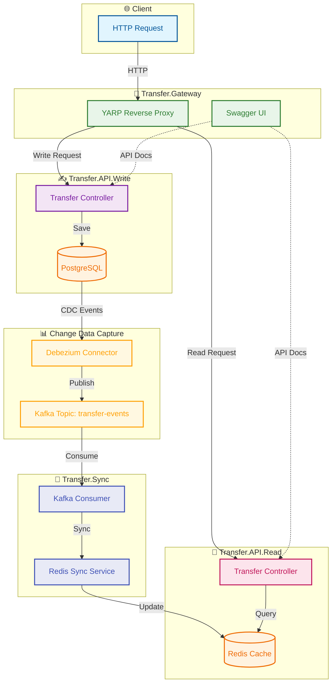

# Transfer Mikroservis Mimarisi

Bu proje, para transferi işlemlerini yöneten ve Change Data Capture (CDC) teknolojisi kullanan bir mikroservis mimarisidir. Proje CQRS (Command Query Responsibility Segregation) ve Event Sourcing prensiplerine dayanarak tasarlanmıştır.

## Mimari Diyagramı



## Mimari Bileşenler

Proje dört ana servisten oluşmaktadır:

1. **Transfer.Gateway**: 
   - YARP (Yet Another Reverse Proxy) tabanlı API Gateway
   - Swagger UI entegrasyonu ile tüm mikroservislerin API dokümantasyonunu birleştirir
   - İstemci isteklerini ilgili mikroservislere yönlendirir

2. **Transfer.API.Write**:
   - Transfer kayıtlarını oluşturan (Create) API
   - PostgreSQL veritabanında Code First yaklaşımı ile çalışır
   - MediatR kullanarak CQRS Command modelini uygular

3. **Transfer.API.Read**:
   - Transfer kayıtlarını sorgulayan (Query) API
   - Redis'te saklanan verileri okur
   - MediatR kullanarak CQRS Query modelini uygular

4. **Transfer.Sync**:
   - Background Worker Service olarak çalışır
   - Debezium/Kafka üzerinden PostgreSQL CDC olaylarını dinler
   - Veri değişikliklerini otomatik olarak Redis'e senkronize eder

5. **Transfer.Shared**:
   - Tüm servisler tarafından paylaşılan modeller ve servisler
   - Redis istemci servisi
   - Debezium mesaj modelleri

## Teknoloji Stack'i

- **Backend**: .NET 9
- **Veritabanları**: 
  - PostgreSQL (Write Model/Command)
  - Redis (Read Model/Query)
- **Mesajlaşma**:
  - Kafka (Event Bus)
  - Debezium (CDC Connector)
- **Konteynerizasyon**: Docker ve Docker Compose
- **API Gateway**: YARP (Yet Another Reverse Proxy)
- **Mimari**:
  - CQRS (Command Query Responsibility Segregation)
  - CDC (Change Data Capture)
  - Event-Driven Design
- **Kütüphaneler**:
  - Entity Framework Core
  - MediatR
  - StackExchange.Redis
  - Confluent.Kafka
  - Swashbuckle/Swagger

## Veri Akışı

1. İstemci `Transfer.Gateway` üzerinden `Transfer.API.Write` servisine istek gönderir
2. `Transfer.API.Write` transfer kaydını PostgreSQL veritabanına yazar
3. Debezium PostgreSQL'deki değişiklikleri yakalar ve Kafka'ya olay olarak gönderir
4. `Transfer.Sync` servisi Kafka'dan olayları tüketerek Redis'e iletir
5. `Transfer.API.Read` servisi `Transfer.Gateway` üzerinden gelen istekler için Redis'ten veri okur

## Transfer Entity Modeli

```csharp
public class TransferEntity
{
    public int Id { get; set; }
    public int FromAccount { get; set; }
    public int ToAccount { get; set; }
    public decimal Amount { get; set; }
    public DateTime CreatedAt { get; set; }
    public string? Description { get; set; }
}
```

## Kurulum

### Gereksinimler

- .NET 9 SDK
- Docker ve Docker Compose
- PostgreSQL (yerel veya Docker üzerinde)
- Redis (Docker Compose ile sağlanır)

### Adımlar

1. Projeyi klonlayın
   ```bash
   git clone https://github.com/username/DebeziumExample.git
   cd DebeziumExample
   ```

2. Docker Compose ile altyapıyı başlatın
   ```bash
   docker-compose up -d
   ```

3. Debezium Connector'ı kaydedin
   ```bash
   ./register-connector.sh
   ```

4. Transfer.API.Write için migrasyon oluşturun ve veritabanını güncelleyin
   ```bash
   cd src/Transfer.API.Write
   dotnet ef migrations add InitialCreate
   dotnet ef database update
   ```

5. Her bir servisi ayrı terminal penceresinde çalıştırın
   ```bash
   # Terminal 1
   dotnet run --project src/Transfer.API.Write
   
   # Terminal 2
   dotnet run --project src/Transfer.API.Read
   
   # Terminal 3
   dotnet run --project src/Transfer.Gateway
   
   # Terminal 4
   dotnet run --project src/Transfer.Sync
   ```

## Servis Endpoint'leri

- **Transfer.Gateway**: http://localhost:5000
  - Swagger UI: http://localhost:5000/swagger
  - Write API Proxy: http://localhost:5000/proxy-write
  - Read API Proxy: http://localhost:5000/proxy-read

- **Transfer.API.Write**: http://localhost:5077
  - Swagger UI: http://localhost:5077/swagger
  - Transfer Endpoint: POST http://localhost:5077/api/Transfer

- **Transfer.API.Read**: http://localhost:5069
  - Swagger UI: http://localhost:5069/swagger
  - Transfer Endpoint: GET http://localhost:5069/api/Transfer/{id}

## Debezium ve Kafka İzleme

- **Kafka UI**: http://localhost:8090
- **Debezium UI**: http://localhost:8080

## Yapılandırma

### PostgreSQL Bağlantısı (Transfer.API.Write ve Transfer.Sync)

```json
{
  "ConnectionStrings": {
    "DefaultConnection": "PORT=5432;TIMEOUT=120;POOLING=True;MINPOOLSIZE=1;MAXPOOLSIZE=5;COMMANDTIMEOUT=180;DATABASE=TransferDb;HOST=localhost;PASSWORD=1;USER ID=postgres"
  }
}
```

### Redis Bağlantısı (Transfer.API.Read ve Transfer.Sync)

```json
{
  "RedisSettings": {
    "Host": "localhost",
    "Port": 6380,
    "Password": "R3d1s_Super_Secure_P@ssw0rd!"
  }
}
```

### Kafka Bağlantısı (Transfer.Sync)

```json
{
  "KafkaSettings": {
    "BootstrapServers": "localhost:9092",
    "GroupId": "transfer-sync-group-dev",
    "AutoOffsetReset": "Earliest",
    "TopicName": "transfer-events"
  }
}
```

### API Gateway Yapılandırması (Transfer.Gateway)

```json
{
  "ReverseProxy": {
    "Routes": {
      "write-api-route": {
        "ClusterId": "write-api-cluster",
        "Match": {
          "Path": "/proxy-write/api/Transfer"
        },
        "Transforms": [
          {
            "PathPattern": "/api/Transfer"
          }
        ]
      },
      /* ... diğer rotalar ... */
    },
    "Clusters": {
      "write-api-cluster": {
        "Destinations": {
          "Default": {
            "Address": "http://localhost:5077",
            "Swaggers": [
              {
                "PrefixPath": "/proxy-write",
                "Paths": [
                  "/swagger/v1/swagger.json"
                ]
              }
            ]
          }
        }
      },
      /* ... diğer cluster'lar ... */
    }
  }
}
```

## Debezium Connector Yapılandırması

```json
{
  "name": "transfer-connector",
  "config": {
    "connector.class": "io.debezium.connector.postgresql.PostgresConnector",
    "tasks.max": "1",
    "database.hostname": "host.docker.internal",
    "database.port": "5432",
    "database.user": "postgres",
    "database.password": "1",
    "database.dbname": "TransferDb",
    "database.server.name": "postgres",
    "table.include.list": "public.transfers",
    "topic.prefix": "postgres",
    "plugin.name": "pgoutput",
    "transforms": "route",
    "transforms.route.type": "org.apache.kafka.connect.transforms.RegexRouter",
    "transforms.route.regex": "([^.]+)\\.([^.]+)\\.([^.]+)",
    "transforms.route.replacement": "transfer-events",
    "key.converter": "org.apache.kafka.connect.storage.StringConverter",
    "key.converter.schemas.enable": "false",
    "value.converter": "org.apache.kafka.connect.json.JsonConverter",
    "value.converter.schemas.enable": "false",
    "transforms.filter.condition": "value.op == 'c' || value.op == 'u' || value.op == 'd'"
  }
}
```

## Notlar

- Sistem PostgreSQL logical replication özelliğini kullanır, bu nedenle veritabanınız bu özelliği desteklemelidir
- Docker Compose, Docker Desktop'ın Mac/Windows üzerinde çalıştırılması durumunda `host.docker.internal` adresini kullanarak host makinedeki PostgreSQL'e bağlanır
- Debezium Connector'ı kaydettikten sonra, Kafka UI veya Debezium UI üzerinden bağlantı durumunu kontrol edebilirsiniz
- Gateway Swagger UI, tüm servislerden gelen Swagger dokümantasyonlarını birleştirir ve tek bir arayüzden erişim sağlar

## Proje Dizin Yapısı

```
/
├── docker-compose.yml           # Docker Compose yapılandırması
├── register-connector.sh        # Debezium connector kaydı için script
├── debezium-connector.json      # Debezium connector yapılandırması
├── src/
│   ├── Transfer.API.Write/      # Yazma API'si
│   │   ├── Controllers/         # API Controller'ları
│   │   ├── Features/            # CQRS Feature'ları
│   │   │   └── Transfers/       # Transfer özellikleri
│   │   │       ├── Commands/    # Command sınıfları
│   │   │       └── Models/      # Model sınıfları
│   │   └── Infrastructure/      # Altyapı sınıfları
│   │       └── TransferDbContext.cs  # EF Core DbContext
│   │
│   ├── Transfer.API.Read/       # Okuma API'si
│   │   ├── Controllers/         # API Controller'ları
│   │   ├── Features/            # CQRS Feature'ları
│   │   │   └── Transfers/       # Transfer özellikleri
│   │   │       ├── Queries/     # Query sınıfları
│   │   │       └── Models/      # Model sınıfları
│   │   └── Infrastructure/      # Altyapı sınıfları
│   │       └── RedisService.cs  # Redis servis sınıfı
│   │
│   ├── Transfer.Gateway/        # API Gateway
│   │   ├── Extensions/          # Extension method'ları
│   │   │   └── SwaggerExtensions.cs  # Swagger entegrasyonu
│   │   └── Program.cs           # Gateway konfigürasyonu
│   │
│   ├── Transfer.Sync/           # Senkronizasyon servisi
│   │   └── Service/             # Worker servisler
│   │       └── TransferSyncService.cs # Kafka dinleyici servisi
│   │
│   └── Transfer.Shared/         # Paylaşılan kütüphane
│       ├── Models/              # Paylaşılan modeller
│       │   ├── TransferEntity.cs    # Transfer entity sınıfı
│       │   ├── DebeziumMessage.cs   # Debezium mesaj modeli
│       │   └── DebeziumTransferDto.cs # Debezium transfer DTO
│       └── Infrastructure/      # Paylaşılan altyapı
│           └── RedisService.cs  # Redis servis sınıfı
``` 

## Commit Kuralları

Bu projede [Conventional Commits](https://www.conventionalcommits.org/) standardı kullanılmaktadır. Her commit mesajı aşağıdaki formatta olmalıdır:

```
<type>[optional scope]: <description>

[optional body]

[optional footer(s)]
```

### Commit Tipleri

- `feat`: Yeni bir özellik eklendiğinde
- `fix`: Bir hata düzeltildiğinde
- `docs`: Sadece dokümantasyon değişikliklerinde
- `style`: Kod formatlaması, noktalı virgül eksikleri vb. (kod değişikliği yok)
- `refactor`: Kod refaktörü yapıldığında
- `test`: Test eklendiğinde, test düzeltildiğinde veya değiştirildiğinde
- `chore`: Yapılandırma değişiklikleri, bağımlılık güncellemeleri vb.
- `perf`: Performans iyileştirmeleri
- `ci`: CI/CD yapılandırma değişiklikleri
- `build`: Build sisteminde veya harici bağımlılıklarda değişiklikler

### Örnekler

```bash
# Yeni özellik
feat(api): transfer oluşturma endpoint'i eklendi

# Hata düzeltme
fix(sync): kafka bağlantı hatası düzeltildi

# Dokümantasyon
docs: README dosyası güncellendi

# Refaktör
refactor(write): transfer servisi yeniden yapılandırıldı

# Test
test(read): redis cache testleri eklendi

# Breaking change
feat(api)!: transfer API'si v2'ye güncellendi

# Birden fazla scope
feat(api,db): transfer sistemi yenilendi
```

### Breaking Changes

Breaking change olduğunda, commit mesajında ünlem işareti (`!`) kullanılmalı veya footer'da `BREAKING CHANGE:` ile açıklama eklenmelidir:

```bash
feat(api)!: transfer request/response modeli değiştirildi

# veya

feat(api): transfer endpoint'leri güncellendi

BREAKING CHANGE: Transfer request modeli değiştirildi, önceki versiyonlar artık desteklenmiyor
``` 